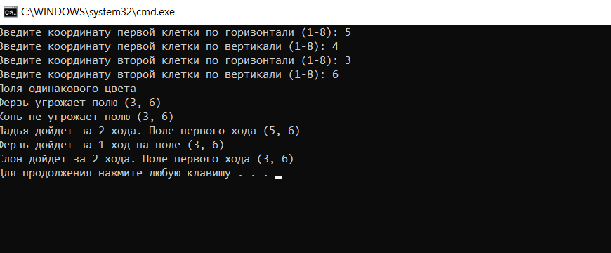

Описание программы
====================
Программа анализирует ходы различных шахматных фигур.
Входные данные - это координаты двух полей. Выходные данные - информация о возможных ходах шахматных фигур с первого на второе поле.

Программа написана на языке программирования Python. Открыть проект можно в среде Visual Studio. Код программы находится в файле chess.py.
